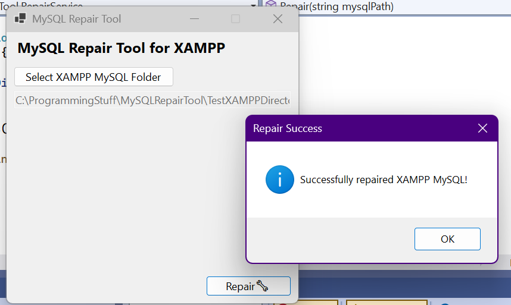

# MySQL Repair Tool for XAMPP

A simple tool to repair corrupted MySQL databases on XAMPP. This is meant to fix a common issue `Error: MySQL shutdown unexpectedly` that appears when starting MySQL service on the XAMPP control panel.

This project is built using C# and .NET 8.0.